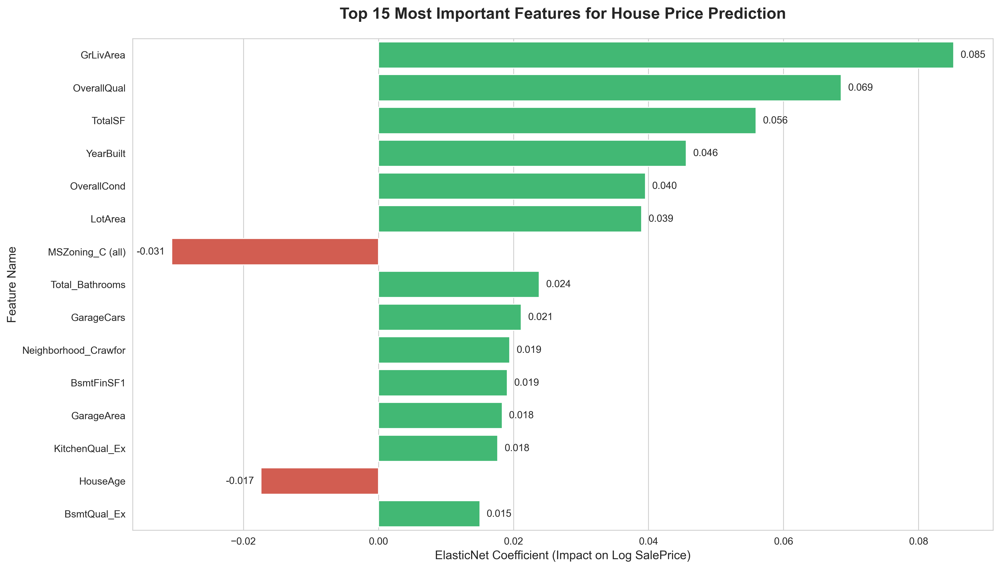

# House Price Prediction: Advanced Regression Techniques 🏡

## 📌 Project Overview
This project predicts house prices based on the famous [Ames Housing dataset](https://www.kaggle.com/c/house-prices-advanced-regression-techniques). Instead of relying on complex black-box models, this project demonstrates how **robust data cleaning, domain-knowledge imputation, and feature engineering** combined with a fine-tuned Linear Model (ElasticNet) can achieve highly competitive results.

## 🏆 Results
* **Evaluation Metric:** Root Mean Squared Logarithmic Error (RMSLE) / Log-transformed RMSE
* **Final Score (K-Fold CV):** `0.1129`
* **Performance:** This score is highly competitive, placing the model roughly in the top 15-20% benchmark of the Kaggle leaderboard using only a single linear model.

### 📊 Model Interpretability (Feature Importance)
The beauty of a properly scaled Linear Model is its transparency. Below are the top 15 features that drive house prices in Ames, Iowa:



*(Green bars indicate features that increase house value, while red bars indicate features that decrease it.)*

## ✨ Key Highlights & Methodology
The success of this model heavily relies on the "Data-Centric" approach. Key steps include:

1. **Outlier Removal:** Removed extreme outliers (e.g., massive houses sold for unusually low prices) from the training set to prevent the linear model from skewing.
2. **Domain-Knowledge Imputation:** 
   * Handled missing values not by blindly using median/mean, but by understanding the context. For example, a missing `PoolQC` or `GarageArea` means the house *lacks* that feature. Filled these with `'None'` or `0` accordingly.
3. **Feature Engineering:** Created high-impact features based on real estate logic:
   * `TotalSF`: Total square footage (Basement + 1st Floor + 2nd Floor).
   * `Total_Bathrooms`: Combined full and half baths across all floors.
   * `HouseAge`: The effective age of the house at the time of sale (`YrSold` - `YearRemodAdd`).
4. **Handling Skewness:** 
   * Applied `np.log1p()` transformation to the target variable (`SalePrice`).
   * Calculated skewness for all numerical features and applied log transformation to those with a skewness > 0.75 to ensure a normal distribution, which is crucial for linear regression.
5. **Model Tuning:** Implemented `ElasticNetCV` with 5-Fold Cross-Validation, expanding the search grid for `alpha` and `l1_ratio` to find the optimal balance between Ridge (L2) and Lasso (L1) regularization.

## 🛠️ Tech Stack
* **Language:** Python
* **Data Manipulation:** `pandas`, `numpy`
* **Machine Learning:** `scikit-learn` (ElasticNetCV, KFold, StandardScaler, SimpleImputer)
* **Statistics:** `scipy` (Skewness calculation)

## 🚀 How to Run the Project

1. **Clone the repository:**
   ```bash
   git clone https://github.com/j22868706/House-Price-Prediction.git
2. **Install dependencies:**
   It is recommended to use a virtual environment. Install the required packages using:
   ```bash
   pip install -r requirements.txt
